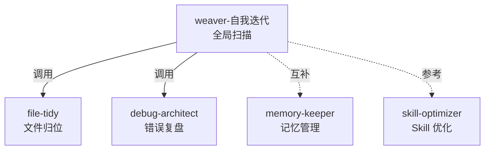
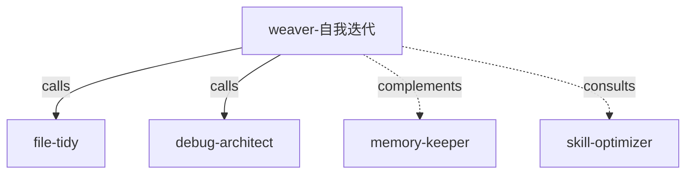

<p align="center">
  
  
  
  <br>
  
  
</p>

# weaver-evolve

<p align="center">
  <b>编织者·自我迭代</b> + 四个子 Skill，一键安装。<br>
  跨项目知识管理：整理、归位、记忆、复盘、优化。
</p>

---

[English](#english)　·　[安装](#-快速安装)　·　[Skill 列表](#-包含的-skill)　·　[设计哲学](#-设计哲学)

---

## 📦 包含的 Skill

| Skill | 角色 | 做什么 |
|-------|------|--------|
| 🧠 [`weaver-自我迭代`](./weaver-自我迭代/) | 主 | 全局知识整理：分层归位、配置审查、经验识别、自我进化 |
| 📂 [`file-tidy`](./file-tidy/) | 子 | 文件系统整理：结构感知归位，不按扩展名瞎归 |
| 💾 [`memory-keeper`](./memory-keeper/) | 子 | 即时记忆管理："记住" / "忘掉" 指令 |
| 🔬 [`debug-architect`](./debug-architect/) | 子 | 错误复盘：扫描 → 根因 → 预防规则 |
| 🎯 [`skill-optimizer`](./skill-optimizer/) | 兄弟 | Skill 级优化：识别改进空间 |

## ⚡ 快速安装

```bash
git clone https://github.com/2021291696/weaver-evolve.git
cd weaver-evolve

# macOS / Linux
bash install.sh

# Windows
powershell -File install.ps1
```

| 选项 | 说明 |
|------|------|
| `--force` / `-Force` | 覆盖已安装的同名 skill |
| `--dry-run` / `-DryRun` | 只看不动 |

## 🔗 协作关系



## 💡 设计哲学

| 原则 | 含义 |
|------|------|
| **定期，不每次** | 拉开距离看，才能看到模式而非噪音 |
| **路由 > 存储** | 价值在"下次能找到"，不在"记下来了" |
| **自迭代是终局** | 体系识别自身漏洞，建议新规则、新 Skill |

## 📄 License

MIT

---

## English

<p align="center">
  <b>The Weaver · Self-Evolution</b> bundled with 4 companion skills.<br>
  One clone, full knowledge management coverage.
</p>

### 📦 Included

| Skill | Role | Purpose |
|-------|------|---------|
| 🧠 [`weaver-自我迭代`](./weaver-自我迭代/) | Core | Cross-project knowledge routing, config audit, pattern recognition, self-evolution |
| 📂 [`file-tidy`](./file-tidy/) | Sub | Structure-aware file organization — no extension-based guessing |
| 💾 [`memory-keeper`](./memory-keeper/) | Sub | Real-time "remember" / "forget" command handling with merge-first philosophy |
| 🔬 [`debug-architect`](./debug-architect/) | Sub | Post-project error analysis: scan → root cause → prevention rules |
| 🎯 [`skill-optimizer`](./skill-optimizer/) | Sibling | Context-aware skill improvement with confidence scoring |

### ⚡ Quick Install

```bash
git clone https://github.com/2021291696/weaver-evolve.git
cd weaver-evolve && bash install.sh   # or: powershell -File install.ps1
```

| Flag | Effect |
|------|--------|
| `--force` / `-Force` | Overwrite existing skills |
| `--dry-run` / `-DryRun` | Preview only |

### 🔗 How They Connect



### 💡 Philosophy

| Principle | Meaning |
|-----------|---------|
| **Periodic, not per-conversation** | Run it periodically and you see patterns, not noise |
| **Routing over storage** | Value is "finding it when needed," not "saving it" |
| **Self-evolution is the endgame** | A system that identifies its own gaps and proposes improvements |
