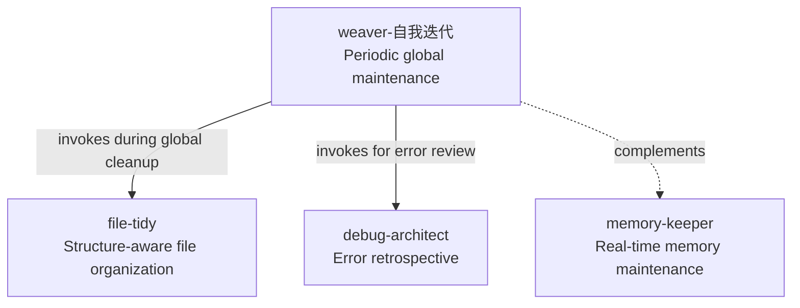

<p align="center">
  
  
  
  <br>
  
  
</p>

# weaver-evolve

<p align="center">
  <strong>A self-evolving knowledge-maintenance suite for Claude Code.</strong><br>
  Route knowledge, organize files, maintain memory, and turn recurring failures into reusable safeguards.
</p>

<p align="center">
  <a href="#overview">English</a> · <a href="#中文说明">中文</a>
</p>

---

## Overview

As Claude Code accumulates skills, project conventions, memories, and session history, useful knowledge can become fragmented or contradictory. **weaver-evolve** provides a periodic maintenance workflow that reviews this growing system from a cross-project perspective.

The suite combines one orchestrator with three focused companion skills:

- route information to the layer where it will remain useful;
- organize misplaced files according to the project's existing structure;
- maintain individual memories at the moment they are created or removed;
- review errors, identify root causes, and propose preventive rules.

## Included Skills

| Skill | Role | What it does |
|---|---|---|
| 🧠 [`weaver-自我迭代`](./skills/weaver-自我迭代/) | Core orchestrator | Runs periodic cross-project maintenance: knowledge routing, configuration review, session-history analysis, pattern discovery, and self-evolution proposals. |
| 📂 [`file-tidy`](./skills/file-tidy/) | File organization | Learns the repository's existing structure and proposes where misplaced files belong instead of sorting blindly by extension. |
| 💾 [`memory-keeper`](./skills/memory-keeper/) | Real-time memory | Handles “remember,” “forget,” and memory-cleanup requests by searching first and integrating changes into the right existing location. |
| 🔬 [`debug-architect`](./skills/debug-architect/) | Error retrospective | Scans error signals, classifies failures, analyzes root causes, archives lessons, and proposes safeguards against recurrence. |

## How the Skills Work Together


```mermaid
graph TD
    W["weaver-自我迭代<br/>Periodic global maintenance"]
    F["file-tidy<br/>Structure-aware file organization"]
    D["debug-architect<br/>Error retrospective"]
    M["memory-keeper<br/>Real-time memory maintenance"]

    W -->|invokes during global cleanup| F
    W -->|invokes for error review| D
    W -.->|complements| M
```

- **`weaver-自我迭代`** is the periodic, system-wide workflow.
- **`file-tidy`** and **`debug-architect`** can be invoked as part of that workflow.
- **`memory-keeper`** operates at a different cadence: it handles individual memory changes immediately, then complements Weaver's later batch review.

## Key Capabilities

| Capability | Description |
|---|---|
| Layer-aware knowledge routing | Places information in the appropriate destination, such as project instructions, rules, operational memory, or a long-term knowledge base. |
| Cross-project review | Looks for duplicated guidance, conflicting conventions, stale configuration, and reusable patterns across projects. |
| Structure-aware cleanup | Respects the repository's existing organization and leaves uncertain files untouched for review. |
| Memory integration | Updates related content in place rather than appending disconnected notes. |
| Error feedback loop | Converts recurring failures into archived lessons and evidence-based prevention suggestions. |
| Confirmation-first changes | Presents plans before high-impact moves, deletions, or memory changes. |

## Quick Install

```bash
git clone https://github.com/2021291696/weaver-evolve.git
cd weaver-evolve

# macOS / Linux
bash install.sh

# Windows PowerShell
powershell -File install.ps1
```

By default, the installers copy skills to `~/.claude/skills`. Set the `CLAUDE_SKILLS` environment variable to use a different destination.

| Option | Description |
|---|---|
| `--force` / `-Force` | Overwrite installed skills with the same names. |
| `--dry-run` / `-DryRun` | Preview the installation without changing files. |

## Typical Usage

Use the core workflow periodically rather than after every conversation. Example triggers include:

```text
编织一下
全局整理
整理知识网络
/weaver
/global-tidy
```

The companion skills can also be used independently for focused file organization, memory maintenance, or error retrospectives. See each skill's README for its commands, safeguards, and detailed workflow.

## Design Principles

| Principle | Meaning |
|---|---|
| **Periodic, not constant** | Distance reveals patterns that are invisible in a single conversation. |
| **Routing over storage** | Knowledge is valuable when it can be found at the right moment, not merely when it has been saved. |
| **Integrate before appending** | Prefer updating the correct existing source over creating another isolated fragment. |
| **Structure before automation** | Learn the system's current organization before moving or rewriting anything. |
| **Self-evolution as the endgame** | A mature knowledge system should identify its own gaps and propose better rules, skills, and workflows. |

## Repository Layout

```text
weaver-evolve/
├── skills/
│   ├── weaver-自我迭代/
│   ├── file-tidy/
│   ├── memory-keeper/
│   └── debug-architect/
├── install.sh
├── install.ps1
└── README.md
```

## License

Released under the [MIT License](./LICENSE).

---

## 中文说明

**weaver-evolve** 是一套面向 Claude Code 的自我迭代知识维护方案，由一个全局编排 Skill 和三个职责清晰的配套 Skill 组成。它适合定期运行，用来整理跨项目知识、维护记忆、归位文件，并把重复错误转化为可复用的预防规则。

### 包含的 Skill

| Skill | 定位 | 主要职责 |
|---|---|---|
| 🧠 [`weaver-自我迭代`](./skills/weaver-自我迭代/) | 核心编排 | 跨项目知识分层归位、配置审查、历史对话提炼、经验识别与自我进化。 |
| 📂 [`file-tidy`](./skills/file-tidy/) | 文件整理 | 学习项目已有结构，为放错位置的文件提出归位方案，不按扩展名机械分类。 |
| 💾 [`memory-keeper`](./skills/memory-keeper/) | 即时记忆 | 处理“记住”“忘掉”和记忆整理请求，先搜索、再融入，避免碎片化追加。 |
| 🔬 [`debug-architect`](./skills/debug-architect/) | 错误复盘 | 扫描报错、分析根因、归档经验，并提出防止问题复发的规则建议。 |

### 协作方式

- `weaver-自我迭代` 负责定期的全局整理。
- 全局整理过程中可调用 `file-tidy` 做结构感知的文件归位，并调用 `debug-architect` 完成错误复盘。
- `memory-keeper` 负责单条记忆的即时维护，与 Weaver 的周期性批量整理互补。

### 快速安装

```bash
git clone https://github.com/2021291696/weaver-evolve.git
cd weaver-evolve

# macOS / Linux
bash install.sh

# Windows PowerShell
powershell -File install.ps1
```

默认安装到 `~/.claude/skills`。如需修改目标目录，可设置 `CLAUDE_SKILLS` 环境变量。

| 选项 | 说明 |
|---|---|
| `--force` / `-Force` | 覆盖已安装的同名 Skill。 |
| `--dry-run` / `-DryRun` | 仅预览，不修改文件。 |

### 设计理念

- **定期，而非每次对话后运行**：拉开距离，才能识别模式而不是噪音。
- **路由优先于存储**：重点不是“记下来了”，而是“下次能在正确位置找到”。
- **融入优先于追加**：优先更新已有相关内容，减少孤立碎片。
- **先理解结构，再自动整理**：不确定的内容保留给用户判断。
- **自我迭代是终局**：系统应能识别自身缺口，并提出更好的规则、Skill 与工作流。

## License / 许可证

本项目采用 [MIT License](./LICENSE)。
