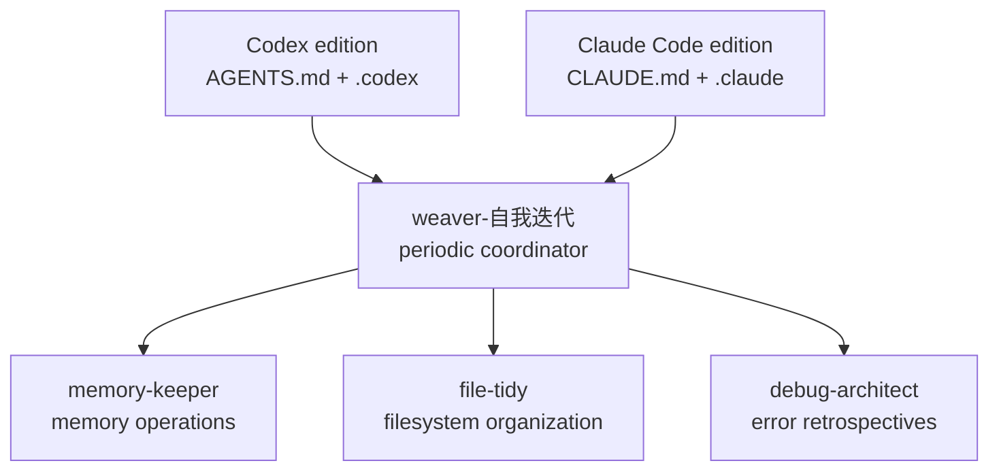

<div align="center">


# weaver-evolve

**A dual-platform knowledge-maintenance suite built for OpenAI Codex and Claude Code.**

Codex-native skills and preserved Claude Code workflows for organizing agent instructions, project memory, files, and recurring debugging lessons.

[English](#english) · [中文](#中文)

</div>

---

<a id="english"></a>

## English

### Overview

**weaver-evolve** is designed around two first-class coding-agent environments:

- **OpenAI Codex** — dedicated skills built around `AGENTS.md`, `.codex/config.toml`, `$skill-name`, and Codex skill directories.
- **Claude Code** — the original workflows remain available with their native `CLAUDE.md`, `.claude`, and session conventions.

The two editions share the same four responsibilities, but they are not a blind copy of one another. Each edition uses the host platform's own instruction hierarchy, configuration paths, invocation model, and available context.

### Included Skills

| Skill | Purpose |
|---|---|
| **weaver-自我迭代** | Coordinates periodic cross-project knowledge maintenance and turns repeated work into durable guidance. |
| **memory-keeper** | Handles immediate remember, forget, and memory-reorganization requests. |
| **file-tidy** | Learns an existing directory structure before proposing safe file moves or cleanup. |
| **debug-architect** | Converts recurring errors into root-cause records, prevention rules, and skill improvements. |

### Platform Editions

| Capability | OpenAI Codex edition | Claude Code edition |
|---|---|---|
| Skill source | `skills/codex/<skill>/` | `skills/<skill>/` |
| Personal skill directory | `~/.agents/skills/` | `~/.claude/skills/` |
| Repository skill directory | `.agents/skills/` | `.claude/skills/` |
| Durable project guidance | `AGENTS.md` | `CLAUDE.md` |
| Personal guidance | `~/.codex/AGENTS.md` | `~/.claude/CLAUDE.md` |
| Configuration | `~/.codex/config.toml`, `.codex/config.toml` | `~/.claude/settings.json` |
| Explicit invocation | `$skill-name` | `/skill-name` or the host's skill invocation flow |

### How the Skills Work Together


```mermaid
flowchart TD
    W["weaver-自我迭代<br/>periodic coordinator"]
    M["memory-keeper<br/>memory operations"]
    F["file-tidy<br/>filesystem organization"]
    D["debug-architect<br/>error retrospectives"]
    C["Codex edition<br/>AGENTS.md + .codex"]
    H["Claude Code edition<br/>CLAUDE.md + .claude"]

    W --> M
    W --> F
    W --> D
    C --> W
    H --> W
```

You can use each skill independently. `weaver-自我迭代` acts as the periodic coordinator when you want a broader maintenance pass.

### Installation

The installers support `codex`, `claude`, or `all`. The default is `all` so both first-class editions are installed.

#### macOS / Linux

```bash
git clone https://github.com/2021291696/weaver-evolve.git
cd weaver-evolve

# Install both editions
bash install.sh

# Or install one edition
bash install.sh --platform codex
bash install.sh --platform claude
```

Use `--dry-run` to inspect the plan and `--force` to replace existing skill directories:

```bash
bash install.sh --platform all --dry-run
bash install.sh --platform codex --force
```

#### Windows PowerShell

```powershell
git clone https://github.com/2021291696/weaver-evolve.git
Set-Location weaver-evolve

# Install both editions
.\install.ps1

# Or install one edition
.\install.ps1 -Platform Codex
.\install.ps1 -Platform Claude
```

Use `-DryRun` to inspect the plan and `-Force` to replace existing skill directories:

```powershell
.\install.ps1 -Platform All -DryRun
.\install.ps1 -Platform Codex -Force
```

Optional destination overrides:

```bash
CODEX_SKILLS=/custom/codex/skills CLAUDE_SKILLS=/custom/claude/skills bash install.sh
```

```powershell
$env:CODEX_SKILLS = "D:\agent-skills\codex"
$env:CLAUDE_SKILLS = "D:\agent-skills\claude"
.\install.ps1
```

### Usage

#### OpenAI Codex

Codex can choose a skill from its description or you can invoke one explicitly:

```text
$weaver-自我迭代 review knowledge accumulated across my projects
$memory-keeper remember that this repository uses uv instead of pip
$file-tidy organize the misplaced files, but show me the plan first
$debug-architect turn the recurring build failure into a prevention rule
```

Codex loads personal skills from `~/.agents/skills` and repository-specific skills from `.agents/skills`. If an installed skill is not visible immediately, restart Codex.

#### Claude Code

The original Claude Code edition is preserved under `skills/<skill>/` and installed into `~/.claude/skills` by default. Use the skill through Claude Code's custom-skill or command workflow, or ask for the task in natural language when your setup routes matching requests to skills.

### Safety Model

All four skills follow the same guardrails:

1. **Inspect before changing** — understand current structure and instruction scope first.
2. **Plan before destructive actions** — deletion, overwrite, broad moves, and durable rule changes require a clear preview and user confirmation.
3. **Use the narrowest scope** — global rules are reserved for genuinely cross-project behavior.
4. **Preserve evidence** — record sources and confidence when extracting lessons from history or errors.
5. **Respect host capabilities** — do not invent session formats, configuration keys, or permission behavior that the active agent cannot verify.

### Repository Layout

```text
weaver-evolve/
├── skills/
│   ├── codex/                    # Codex-native implementations
│   │   ├── weaver-自我迭代/
│   │   ├── file-tidy/
│   │   ├── memory-keeper/
│   │   └── debug-architect/
│   ├── weaver-自我迭代/           # Claude Code implementations
│   ├── file-tidy/
│   ├── memory-keeper/
│   └── debug-architect/
├── install.sh                    # macOS/Linux dual-platform installer
├── install.ps1                  # Windows dual-platform installer
├── LICENSE
└── README.md
```

Other experimental or historical content may exist in the repository, but it is not part of the active four-skill suite described or installed here.

---

<a id="中文"></a>

## 中文

### 项目简介

**weaver-evolve** 现在主要服务于两个一等平台：**OpenAI Codex** 与 **Claude Code**。

- **Codex 版**是专门适配的实现，围绕 `AGENTS.md`、`.codex/config.toml`、`$skill-name`、`~/.agents/skills` 等 Codex 原生约定工作。
- **Claude Code 版**保留原有实现，继续使用 `CLAUDE.md`、`.claude` 目录和 Claude Code 的上下文约定。

两套版本共享四个核心职责，但不是把同一份文件机械复制到两个目录。每套 Skill 都按对应 Agent 的指令层级、配置位置、调用方式和可访问上下文进行编写。

### 四个核心 Skill

| Skill | 职责 |
|---|---|
| **weaver-自我迭代** | 定期执行跨项目知识整理，把重复工作和踩坑转化为长期规则。 |
| **memory-keeper** | 即时处理“记住”“忘掉”和“整理记忆”等请求。 |
| **file-tidy** | 先学习现有目录结构，再安全地提出文件归位和清理方案。 |
| **debug-architect** | 复盘重复错误，沉淀根因、预防规则和 Skill 改进建议。 |

### 安装

安装脚本支持 `Codex`、`Claude` 或 `All`，默认安装两套版本。

#### macOS / Linux

```bash
git clone https://github.com/2021291696/weaver-evolve.git
cd weaver-evolve

bash install.sh                    # 两套都安装
bash install.sh --platform codex   # 只安装 Codex 版
bash install.sh --platform claude  # 只安装 Claude Code 版
```

#### Windows PowerShell

```powershell
git clone https://github.com/2021291696/weaver-evolve.git
Set-Location weaver-evolve

.\install.ps1                   # 两套都安装
.\install.ps1 -Platform Codex   # 只安装 Codex 版
.\install.ps1 -Platform Claude  # 只安装 Claude Code 版
```

可以加 `--dry-run` / `-DryRun` 只查看安装计划，加 `--force` / `-Force` 覆盖已有 Skill。

### Codex 中使用

Codex 可以根据 `description` 自动匹配，也可以显式使用 `$skill-name`：

```text
$weaver-自我迭代 做一次跨项目知识整理
$memory-keeper 记住这个仓库统一使用 uv
$file-tidy 整理放错位置的文件，先给计划
$debug-architect 复盘最近重复出现的构建错误
```

### Claude Code 中使用

Claude Code 原版位于 `skills/<skill>/`，默认安装到 `~/.claude/skills/`。可以继续通过 Claude Code 的自定义 Skill、命令路由或自然语言触发方式使用。

### 设计原则

- Codex 与 Claude Code 都是一等平台，不把其中一个仅作为“兼容目标”。
- 平台相关概念分别实现，避免把 `CLAUDE.md` 直接套到 Codex，或把 `AGENTS.md` 强行套到 Claude Code。
- 全局规则保持克制；信息不确定时优先放到更窄的项目范围。
- 删除、覆盖、跨目录移动和长期规则写入之前，先展示方案并获取确认。
- 无法验证的平台能力必须明确说明限制，不能虚构 session 格式或配置行为。

## License / 许可证

This project is licensed under the [MIT License](./LICENSE).
本项目采用 [MIT License](./LICENSE)。
